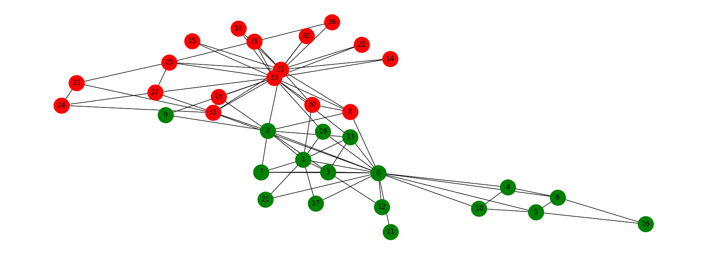
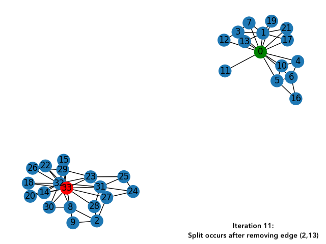
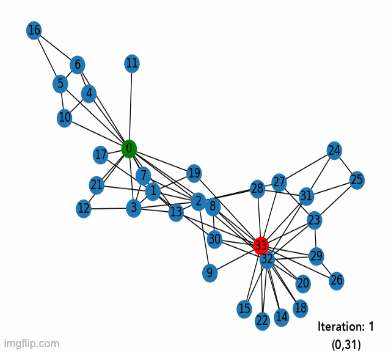

# SocialNetwork_GraphPartitioning
A project which investigates the spilt of the Karate Club Social Network using Networkx

This project:
* Draws the original Karate Club graph before the split, and colors the nodes based on the factions they belong to.
* Uses the Girvan-Newman algorithm to illustrate the split
* Compares the actual split to the mathematical split

### Before the Split

Red = John
Green = Mr.Hi

### First Split Using Girvan-Newman Algorithm

#### Iterations Until Split:

